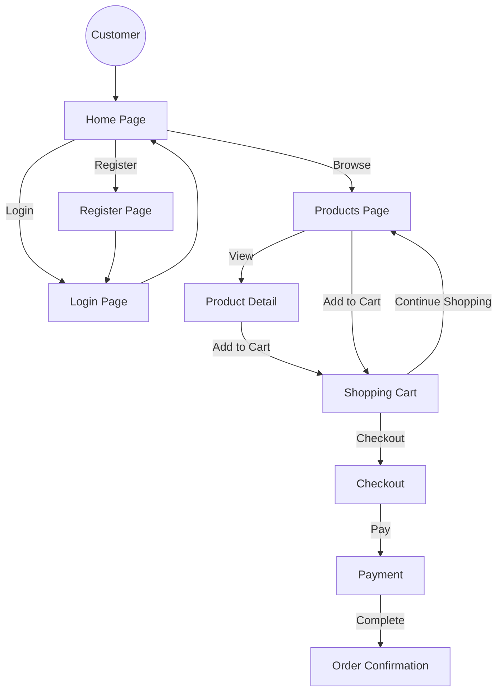
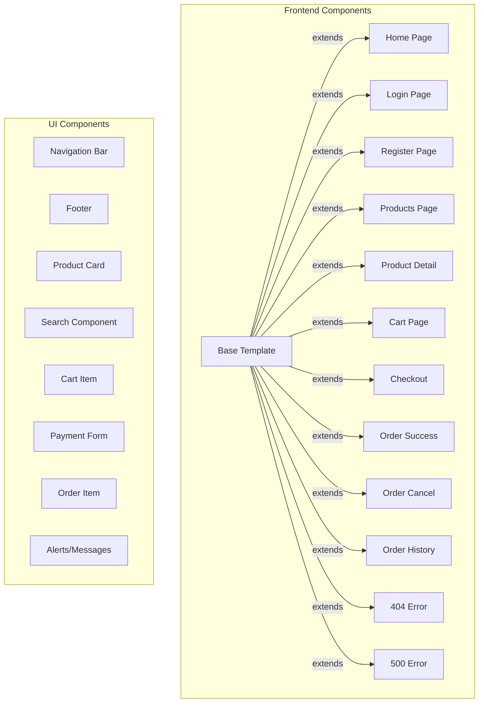
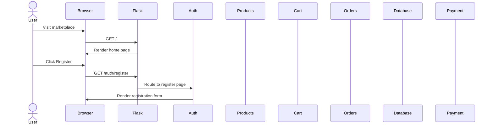
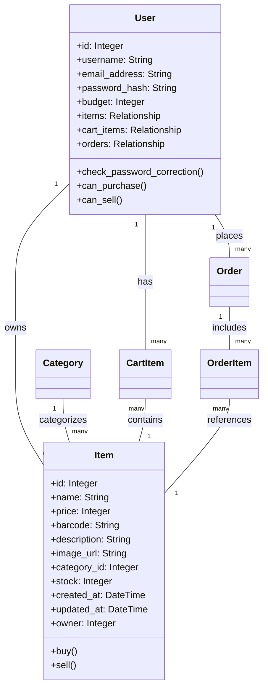

# Flask Marketplace

A modern e-commerce platform built with Flask, featuring product listings, user authentication, shopping cart functionality, and secure payment processing.

![Flask Marketplace Architecture](https://private-us-east-1.manuscdn.com/sessionFile/sWS825HKJr3x9oXv6L3FEY/sandbox/YuR6nZZ1hnne0Rn85JWbdb-images_1744764163740_na1fn_L2hvbWUvdWJ1bnR1L2ZsYXNrX21hcmtldHBsYWNlX2ltcHJvdmVtZW50cy9kb2N1bWVudGF0aW9uL2FyY2hpdGVjdHVyZV9kaWFncmFt.png?Policy=eyJTdGF0ZW1lbnQiOlt7IlJlc291cmNlIjoiaHR0cHM6Ly9wcml2YXRlLXVzLWVhc3QtMS5tYW51c2Nkbi5jb20vc2Vzc2lvbkZpbGUvc1dTODI1SEtKcjN4OW9YdjZMM0ZFWS9zYW5kYm94L1l1UjZuWloxaG5uZTBSbjg1SldiZGItaW1hZ2VzXzE3NDQ3NjQxNjM3NDBfbmExZm5fTDJodmJXVXZkV0oxYm5SMUwyWnNZWE5yWDIxaGNtdGxkSEJzWVdObFgybHRjSEp2ZG1WdFpXNTBjeTlrYjJOMWJXVnVkR0YwYVc5dUwyRnlZMmhwZEdWamRIVnlaVjlrYVdGbmNtRnQucG5nIiwiQ29uZGl0aW9uIjp7IkRhdGVMZXNzVGhhbiI6eyJBV1M6RXBvY2hUaW1lIjoxNzY3MjI1NjAwfX19XX0_&Key-Pair-Id=K2HSFNDJXOU9YS&Signature=L8nk~lMUx8BB4pj1vsRl~NUtizAuh3nXfdU~7yZmXAlGawDXA6hJB6xo2KbUukNNAx2vYxTfsGm0~ekHhFHofWIHlgx3gEEK-wDfX~oCOf~X0Z-2ou8-Ilh8mAKCRnZl6TZ0C6KcCjIUFXlbLUG~ZdQdcUSILid6u~Ys~3L7tMtVzlg0HjkyuIPlGMAugTScYBo4NIuxjflESU20kQQxmdsJThniv8PVfcrB4nK1dPX7wwlMhrvz7f1ODc~5Pnfj90Qk2JqapJY-t7I50QHUeJfIbqpAOlHVasygidSXjmUXLrGHd5Bv53Ec7C0L-eqbWyPJshUJL3ox-xVC5d9yNg__)

## Table of Contents

- [Project Overview](#project-overview)
- [Features](#features)
- [System Design](#system-design)
- [Architecture](#architecture)
- [User Experience](#user-experience)
- [Database Design](#database-design)
- [Implementation Details](#implementation-details)
- [Installation](#installation)
- [Usage](#usage)
- [Learning Points](#learning-points)

## Project Overview

Flask Marketplace is a comprehensive e-commerce web application that allows users to browse products, create accounts, add items to their shopping cart, and complete purchases. The system is designed with a focus on security, performance, and maintainability.

## Features

- **User Authentication**: Register, login, and profile management
- **Product Management**: Browse, search, and filter products by categories
- **Shopping Cart**: Add, update, and remove items from cart
- **Checkout Process**: Secure payment processing with Stripe integration
- **Order Management**: View order history and details
- **Responsive Design**: Mobile-friendly interface

## System Design

### System Architecture

The Flask Marketplace follows a modular architecture based on the Model-View-Controller (MVC) pattern, implemented through Flask's blueprint system:

- **Models**: Database entities representing users, products, categories, cart items, and orders
- **Views**: Jinja2 templates for rendering HTML pages
- **Controllers**: Route handlers for processing requests and responses

### Architectural Patterns

- **MVC Pattern**: Separation of data, user interface, and control logic
- **Blueprint Pattern**: Modular organization of application components
- **Factory Pattern**: Application creation through a factory function

For more details, see the [full system design documentation](documentation/system_design.md).

## Architecture

The application is structured using Flask blueprints to organize functionality by feature:

```
flask_marketplace/
├── market/                      # Main application package
│   ├── __init__.py              # Application factory
│   ├── config.py                # Configuration settings
│   ├── models.py                # Database models
│   ├── extensions.py            # Flask extensions
│   ├── blueprints/              # Blueprint modules
│   │   ├── auth/                # Authentication blueprint
│   │   ├── main/                # Main pages blueprint
│   │   ├── products/            # Products blueprint
│   │   ├── cart/                # Shopping cart blueprint
│   │   └── orders/              # Orders blueprint
│   └── templates/               # HTML templates
├── run.py                       # Application runner
├── setup_db.py                  # Database initialization
└── requirements.txt             # Project dependencies
```
## User Experience

### User Flow

The application provides a seamless user experience with intuitive navigation:



### UI Components

The user interface is built with a component-based approach:



### Sequence Diagram

The following sequence diagram illustrates the interactions between system components during key processes:



For the complete sequence diagram, see the [full documentation](documentation/sequence_diagram.md).

## Database Design

The database consists of the following main entities:



For the complete database model diagram, see the [full documentation](documentation/database_model_diagram.md).

## Implementation Details

### Authentication System

The authentication system is implemented using Flask-Login and bcrypt for password hashing:

```python
@auth_bp.route('/register', methods=['GET', 'POST'])
def register_page():
    form = RegisterForm()
    if form.validate_on_submit():
        user_to_create = User(username=form.username.data,
                              email_address=form.email_address.data,
                              password=form.password1.data)
        db.session.add(user_to_create)
        db.session.commit()
        login_user(user_to_create)
        flash(f"Account created successfully!", category='success')
        return redirect(url_for('main.home_page'))
```

### Shopping Cart Implementation

The shopping cart is implemented using the CartItem model:

```python
@cart_bp.route('/add', methods=['POST'])
@login_required
def add_to_cart():
    item_id = request.form.get('item_id')
    quantity = int(request.form.get('quantity', 1))
    
    item = Item.query.get_or_404(item_id)
    
    # Check if item is already in cart
    cart_item = CartItem.query.filter_by(user_id=current_user.id, item_id=item_id).first()
    
    if cart_item:
        # Update quantity if already in cart
        cart_item.quantity += quantity
    else:
        # Add new item to cart
        cart_item = CartItem(user_id=current_user.id, item_id=item_id, quantity=quantity)
        db.session.add(cart_item)
    
    db.session.commit()
    flash(f"{item.name} added to your cart!", category='success')
    return redirect(url_for('products.product_list'))
```

For more implementation details, see the [full code explanation](documentation/code_explanation.md).

## Installation

1. Clone the repository:
   ```bash
   git clone https://github.com/yourusername/flask-marketplace.git
   cd flask-marketplace
   ```

2. Create and activate a virtual environment:
   ```bash
   python -m venv venv
   source venv/bin/activate  # On Windows: venv\Scripts\activate
   ```

3. Install dependencies:
   ```bash
   pip install -r requirements.txt
   ```

4. Initialize the database:
   ```bash
   python setup_db.py
   # Type 'y' when prompted to create sample data
   ```

5. Run the application:
   ```bash
   python run.py
   ```

6. Access the application at http://127.0.0.1:5000/

## Usage

### Sample User Account
- Username: testuser
- Password: Password123!

### Key Features

1. **Browse Products**: View all products or filter by category
2. **Product Details**: Click on a product to view detailed information
3. **Shopping Cart**: Add products to your cart and adjust quantities
4. **Checkout**: Process your order with secure payment
5. **Order History**: View your past orders and their status

## Learning Points

This project demonstrates several important concepts in web development:

1. **Flask Application Architecture**: Blueprint pattern for modular organization
2. **Database Modeling**: SQLAlchemy ORM for database interactions
3. **Authentication**: User registration, login, and session management
4. **Security Best Practices**: Password hashing, CSRF protection, secure headers
5. **Payment Processing**: Integration with payment gateways
6. **Performance Optimization**: Caching, database indexing, query optimization
